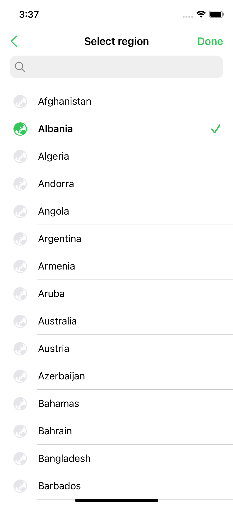

# FS Searchable Region

This is a simple application that displays a set of defined data that corresponds to regions (country).

# Main features (requirements)
- Content is loaded once the screen shows. The data is sorted alphabetically. 
- Tapping the search bar activates the search and pops up the native keyboard.
- User can select a cell by tapping it. This highlights the content by making the name bold, applying a tint on the globe image and a checkmark accessory appears
- User can't select multiple region as tapping one will deselect the previously selected region.
- Searching via the search bar filters the display and only display the items that contain the characters inputted.

# Design Pattern
We went with a modified Model-View-ViewModel (MVVM) design pattern to separate the concerns between Models and Views and have some view model managers to control the access and flow of data from model down to displaying it to the view.

# Assumption
Since we don't have any network call to connect to and in the future, if we want to scale the project to include adding and deleting of regions, we've made it so that the regions are saved in UserDefaults and have a Persistence manager handle the saving and retrieval of data.

# Additional bits
Some bits where added to stay true with the expected behaviour in UX sense as well as following what is shown on the sample screen (mockup)
- Have added the chevron and done as bar button items as this is included in the sample screen
- User cannot reselect a cell. It will deselect the current selected cell.
- When a cell is selected and have entered a search, cell stays selected unless selecting a new cell or re-selecting the cell again to deselect it.
- keyboard pushes the tableview up so that when user scrolls, keyboard doesn't cover the bottom part of the list.

# Screenshot

# License
Project is under the MIT License. Please see the [LICENSE](https://github.com/arvinq/FSSearchableRegion/blob/main/LICENSE) file for more info.
